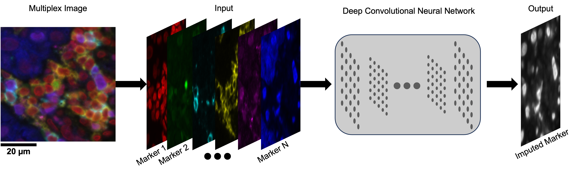

MAXIM: Marker Imputation Model for Multiplex Images
===========



**Deep Leaning Model Imputes Missing Stains in Multiplex Imaging**
<br>
*TL;DR: Multiplex imaging enables simultaneous visualization of multiple protein markers within a tissue sample. However, the increased marker count also increased the likelihood of staining failure, leading to higher costs and time in multiplex image acquisition due to restaining. We address this by proposing a deep learning-based **MA**rker imputation model for multiple**X** **IM**ages (**MAXIM**) that accurately impute protein markers with missing stains. The model is extensively evaluated at pixel and cell levels across various cancer types, and its performance in cell classification is demonstrated. Model interpretability is enhanced by gaining insights into the contribution of individual markers in the imputation process. In practice, MAXIM can reduce the cost and time of multiplex image acquisition by accurately imputing protein markers affected by staining issues.*

© This code is made available for non-commercial academic purposes. 


# Installation
## Pre-requisites
* Python (3.9.13)
* PyTorch (1.13.1)
* TorchVision (0.14.1)
* Numpy (1.12.5)
* Pandas (1.4.4)
* Scipy (1.9.1)
* Scikit-Learn (0.19.2)
* Captum (0.6.0)
* Setuptools (63.4.1)


## Virtual Environment (Optional)
### Using Anaconda
``` shell
conda create -n maxim python=3.9.13
conda activate maxim
```
### Using Python
``` shell
# for Unix/macOS
python3 -m pip install --user virtualenv
python3 -m venv maxim
source maxim/bin/activate

# for Windows
py -m venv maxim
.\maxim\Scripts\activate
```
## Remote Installation (Recommended)
``` shell
pip install git+git://github.com/mahmoodlab/MAXIM.git#egg=maxim
```
## Local Installation
``` shell
git clone https://github.com/mahmoodlab/MAXIM.git
pip install -e ./MAXIM
```

## Development Mode
``` shell
git clone https://github.com/mahmoodlab/MAXIM.git
pip install -r ./MAXIM/requirements.txt
```


# Datasets
The datasets are expected to be prepared in the following format:

1. Image Files: The images should be saved in the `.npy` format, which is the numpy file format. Each image file should contain a numpy array of size **NxHxW**, where:
   - **N** is the number of markers in the multiplex imaging dataset.
   - **H** is the height of the multiplex images.
   - **W** is the width of the multiplex images.

2. CSV File: Along with the image files, a CSV file should be prepared. The CSV file should contain the following columns:
   - `Image_Path`: This column should contain the absolute path of each image file in the dataset.
   - `Split_Name`: This column indicates the data split to which each image belongs, such as 'train', 'valid', or 'test'. 

The dataset should be organized such that each image file corresponds to a row in the CSV file, linking the image path with its respective split name.

Example CSV file structure:
```
Image_Path                          Split_Name
/path/to/image1.npy                 train
/path/to/image2.npy                 valid
/path/to/image3.npy                 test
...
```

# Tutorial
A detailed tutorial on how to use the MAXIM package is provided in the form of a Jupyter Notebook ([tutorial.ipynb](https://github.com/mahmoodlab/MAXIM/blob/main/tutorial.ipynb)). A brief demonstration of how to use the MAXIM package to train a new model and to use a trained model for evaluation of marker imputation is provided below.
## Training
The MAXIM package provides a Trainer class that can be used to train a new marker imputation model. The Trainer class takes several hyperparameters, including the following:

- `marker_panel`: A list of marker names in the same order as the channels in the MXIF images saved as numpy arrays.
- `input_markers`: A list of marker names to be used as input to the model.
- `output_markers`: A list of marker names to be used as output from the model.
- `results_dir`: The directory path where the training results will be saved.
- `lr`: The learning rate for the Adam optimizer.
- `seed`: The random seed for reproducibility.

To train a new marker imputation model, you can use the following code:

```python
from maxim import Trainer

# Define the marker panel, input markers, output markers, and results directory
marker_panel = [...]  # List of marker names in the same order as the channels in the MXIF images
input_markers = [...]  # List of marker names to be used as input to the model
output_markers = [...]  # List of marker names to be used as output from the model
results_dir = '/path/to/results/directory'

# Instantiate the Trainer class
trainer = Trainer(marker_panel, input_markers, output_markers, results_dir)

# Set other hyperparameters if needed
trainer.lr = 0.002
trainer.seed = 1

# Train the model using the data CSV file
data_csv_path = '/path/to/data.csv'
percent = 100  # Percentage of data to use for training (default: 100)
img_size = 256  # Size of the images to be used (default: 256)
batch_size = 64  # Batch size for training (default: 64)
num_workers = 4  # Number of workers for data loading (default: 4)
max_epochs = 200  # Maximum number of epochs to train (default: 200)
minimum_epochs = 50  # Minimum number of epochs to train before early stopping (default: 50)
patience = 25  # Number of epochs with no improvement before early stopping (default: 25)

trainer.train(data_csv_path, percent=percent, img_size=img_size, batch_size=batch_size, num_workers=num_workers,
              max_epochs=max_epochs, minimum_epochs=minimum_epochs, patience=patience)
```

Make sure to replace the placeholder values (`marker_panel`, `input_markers`, `output_markers`, `results_dir`, `data_csv_path`, and other hyperparameters) with the actual values specific to your dataset and desired configuration.

## Evaluation
To evaluate the trained model using the test set, you can use the `eval()` method provided by the `Trainer` class in the MAXIM package. This method performs evaluation on the test data and computes various metrics to assess the model's performance. Here's a description of the evaluation process and an example code:

Following code can be used to evaluate the trained model on the test set:

```python
# Evaluate the model using the test set
data_csv_path = '/path/to/data.csv'
split_name = 'test'  # Name of the split to evaluate (e.g., 'test')
img_size = 256  # Size of the images to be used for evaluation (default: 256)
batch_size = 32  # Batch size for evaluation (default: 32)
num_workers = 4  # Number of workers for data loading (default: 4)

trainer.eval(data_csv_path, split_name=split_name, img_size=img_size, batch_size=batch_size, num_workers=num_workers)
```

Make sure to replace the placeholder values (`data_csv_path`, and other evaluation parameters) with the actual values specific to your trained model and test dataset.

# Issues
- Please report all issues on the public forum.

# License
© This code is made available under the Creative Commons Attribution-NonCommercial-NoDerivatives 4.0 International Public License.